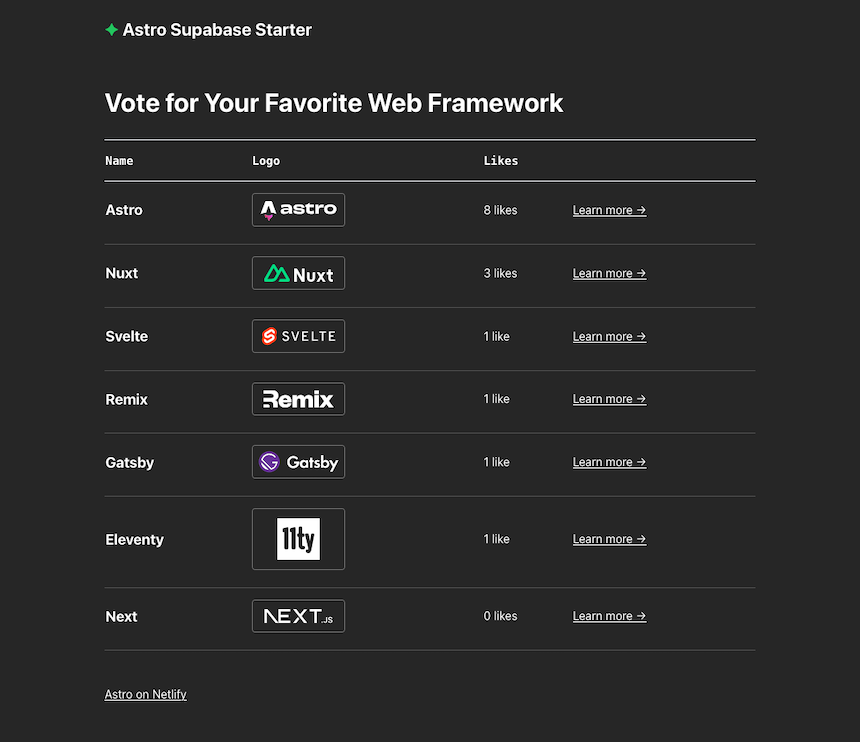

# Astro Supabase Starter



**View demo:** [https://astro-supabase-starter.netlify.app/](https://astro-supabase-starter.netlify.app/)

The Astro Supabase starter demonstrates how to integrate **Supabase** into an Astro project deployed on Netlify.

## Deploying to Netlify

If you click "Deploy to Netlify" button, it will create a new repo for you that looks exactly like this one, and sets that repo up immediately for deployment on Netlify.

[](https://app.netlify.com/start/deploy?repository=https://github.com/netlify-templates/astro-supabase-starter&fullConfiguration=true)

## Astro Commands

All commands are run from the root of the project, from a terminal:

| Command                   | Action                                           |
| :------------------------ | :----------------------------------------------- |
| `npm install`             | Installs dependencies                            |
| `npm run dev`             | Starts local dev server at `localhost:4321`      |
| `npm run build`           | Build your production site to `./dist/`          |
| `npm run preview`         | Preview your build locally, before deploying     |
| `npm run astro ...`       | Run CLI commands like `astro add`, `astro check` |
| `npm run astro -- --help` | Get help using the Astro CLI                     |

## Developing Locally

| Prerequisites                                                                |
| :--------------------------------------------------------------------------- |
| [Node.js](https://nodejs.org/) v18.14+                                       |
| (optional) [nvm](https://github.com/nvm-sh/nvm) for Node version management  |
| [Netlify account](https://netlify.com/)                                      |
| [Netlify CLI](https://docs.netlify.com/cli/get-started/).                    |
| [Supabase account](https://supabase.com/)                                    |

### Set up the PHP backend (SQLite)

This project now uses a PHP backend for all transactional and leaderboard operations, using SQLite for storage. The PHP API is located in `php-backend/api.php`.

#### How to use the PHP backend

1. Make sure you have PHP 7.4+ installed with SQLite3 support.
2. Start the PHP built-in server in the `php-backend` directory:

   ```sh
   cd php-backend
   php -S localhost:9000
   ```

3. The API will be available at `http://localhost:9000/api.php`.

#### API Endpoints

All endpoints are accessed via `GET` or `POST` with an `action` parameter. All data is sent/received as JSON.

### POST /api.php?action=add_answer

Add a player's answer to a question.

Request body:

```json
{
  "question_id": 1,
  "player_name": "Alice",
  "answer": 2,
  "response_time": 3.42
}
```

Response:

```json
{ "status": "ok" }
```

## **GET /api.php?action=get_answers&question_id=1**

Get all answers for a question.

Response:

```json
[
  { "id": 1, "question_id": 1, "player_name": "Alice", "answer": 2, "response_time": 3.42, "created_at": "..." },
  ...
]
```

## **POST /api.php?action=add_leaderboard**

Add a player to the leaderboard.

Request body:

```json
{
  "player_name": "Alice",
  "score": 100
}
```

Response:

```json
{ "status": "ok" }
```

**GET /api.php?action=get_leaderboard**

Get the top 10 players on the leaderboard.

Response:

```json
[
  { "id": 1, "player_name": "Alice", "score": 100, "created_at": "..." },
  ...
]
```

---

**Table structure:**

- `questions`: id, text, options (JSON), correct_option
- `answers`: id, question_id, player_name, answer, response_time, created_at
- `leaderboard`: id, player_name, score, created_at

---

### Install and run locally

1. Clone this repository, then run `npm install` in its root directory.

2. For the starter to have full functionality locally, please ensure you have an up-to-date version of Netlify CLI. Run:

```sh
npm install netlify-cli@latest -g
```

3. Link your local repository to the deployed Netlify site. This will ensure you're using the same runtime version for both local development and your deployed site.

```sh
netlify link
```

4. Then, run the Astro.js development server via Netlify CLI:

```sh
netlify dev --target-port 4321
```

If your browser doesn't navigate to the site automatically, visit [localhost:8888](http://localhost:8888).

## Support

If you get stuck along the way, get help in our [support forums](https://answers.netlify.com/).
